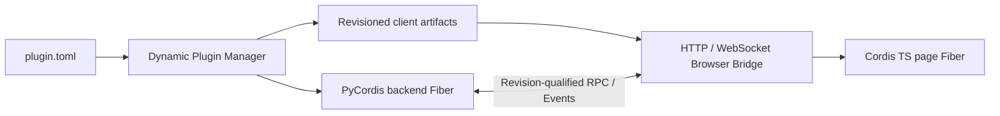

# DeepSeek Harness Python

English | [中文](README.zh.md)

DeepSeek Harness Python is a plugin-first agent harness with two cooperating Cordis runtimes. PyCordis owns backend plugins and the Python Agent Spine. The original TypeScript Cordis remains in the browser and owns page plugins. A versioned Browser Bridge connects them through explicit JSON RPC and Events.

The goal is a stable harness where new product behavior is normally delivered as a plugin, without changing the Agent Loop or either lifecycle kernel.

## Architecture

One logical plugin has one root identity and may contain a backend contribution, a client contribution, or both:

```text
plugin.toml
backend.py
frontend/
  package.json
  src/
  dist/client.js
protocol/api.schema.json
```

`plugin.toml` is authoritative. Nested Python or frontend package files are build inputs and cannot redefine the Plugin ID or version.

| Plugin form | Runtime | Typical use |
|---|---|---|
| Backend only | PyCordis | Tools, LLM providers, storage, workflows, policy |
| Client only | Cordis TS | Panels, commands, page state, browser integrations |
| Full stack | Both | UI backed by Python services through RPC and Events |

The two runtimes do not share objects or lifecycle state. The Dynamic Plugin Manager computes one content Revision from the manifest and declared artifacts, starts the backend Fiber, publishes the exact client bundle, and projects the desired graph to connected pages. Each page then mounts one Cordis TS child Fiber for the same Plugin ID and Revision.



Enable, update, rollback, and disable are live operations. An update disposes the old backend registrations and asks pages to unload the old client Fiber before activating the replacement. Stale Revision calls lose authority. Disable removes publication, backend Effects, page Fiber contributions, and outstanding page-owned calls.

Backend plugins receive their exact Manager-owned identity through the isolated `PLUGIN_RUNTIME_IDENTITY` Service. Browser modules that export `createPlugin(api)` receive a revision-bound `PluginChannel` from reconciliation. Plugins never calculate or accept their own runtime Revision as user configuration.

## Repository layout

```text
harness/
frontend/
docs/specs/
docs/source-notes/
tests/
```

The distribution name is `deepseek-harness-python`; the only supported import root is `harness`. There is no `src/` tree or `deepseek_harness` compatibility package.

## Implemented foundation

- PyCordis Services, isolated Realms, dependency-driven Fibers, reversible Effects, and Event modes.
- Append-only Session Events, scoped Prompt/Tool/LLM registries, and a multi-Step Agent Loop.
- Dynamic backend-only, client-only, and full-stack plugin install, enable, update, rollback, disable, and uninstall.
- Content-addressed client publication, normative Browser Bridge Schema, RPC, Event forwarding, cancellation, and stale-message rejection.
- aiohttp HTTP/WebSocket transport and a real Cordis TS browser adapter with SHA-256 verification and Fiber cleanup.

See [implementation progress](docs/progress.md) and the [foundation completion specification](docs/specs/foundation-completion.md) for acceptance evidence and intentional exclusions.

## Development

```sh
uv sync
uv run python -m unittest discover -s tests -v
uv run ruff check harness tests
uv run pyright

pnpm --dir frontend install
pnpm --dir frontend run typecheck
pnpm --dir frontend run test
pnpm --dir frontend run build
```

The current in-process Python Backend Host is for trusted local plugins. Authentication, package distribution, persistent inventory and Sessions, dependency installation, signatures, and process isolation for untrusted plugins remain product or deployment work.
