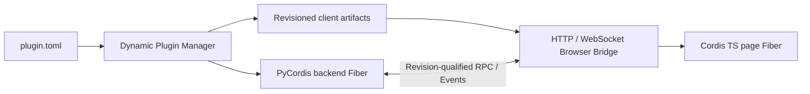

# DeepSeek Harness Python

English | [中文](README.zh.md)

DeepSeek Harness Python is a plugin-first agent harness with two cooperating Cordis runtimes. PyCordis owns backend plugins and the Python Agent Spine. The original TypeScript Cordis remains in the browser and owns page plugins. A versioned Browser Bridge connects them through explicit JSON RPC and Events.

The goal is a stable harness where new product behavior is normally delivered as a plugin, without changing the Agent Loop or either lifecycle kernel.

## Architecture

One logical plugin has one root identity and may contain a backend contribution, a client contribution, or both:

```text
plugin.toml
backend.py
frontend/
  package.json
  src/
  dist/client.js
protocol/api.schema.json
```

`plugin.toml` is authoritative. Nested Python or frontend package files are build inputs and cannot redefine the Plugin ID or version.

| Plugin form | Runtime | Typical use |
|---|---|---|
| Backend only | PyCordis | Tools, LLM providers, storage, workflows, policy |
| Client only | Cordis TS | Panels, commands, page state, browser integrations |
| Full stack | Both | UI backed by Python services through RPC and Events |

The two runtimes do not share objects or lifecycle state. The Dynamic Plugin Manager computes one content Revision from the manifest and declared artifacts, starts the backend Fiber, publishes the exact client bundle, and projects the desired graph to connected pages. Each page then mounts one Cordis TS child Fiber for the same Plugin ID and Revision.



Enable, update, rollback, and disable are live operations. An update disposes the old backend registrations and asks pages to unload the old client Fiber before activating the replacement. Stale Revision calls lose authority. Disable removes publication, backend Effects, page Fiber contributions, and outstanding page-owned calls.

Backend plugins receive their exact Manager-owned identity through the isolated `PLUGIN_RUNTIME_IDENTITY` Service. Browser modules that export `createPlugin(api)` receive a revision-bound `PluginChannel` from reconciliation. Plugins never calculate or accept their own runtime Revision as user configuration.

Browser readiness is derived separately from publication. The Host defaults to requiring every connected page to activate a required client contribution; deployments may select `any_connected` globally or per Plugin ID. A required client plugin stays `WAITING` until a page connects, can recover from `FAILED` without republishing, and reports page-qualified diagnostics through the Manager snapshot.

## Author plugins

The supported Python author API is `harness.sdk`. Backend-only plugins use `define_backend_plugin`; plugins that need the Browser Bridge use `define_bridge_backend_plugin` and identity-free RPC/Event descriptors:

```python
from harness.sdk import define_bridge_backend_plugin, rpc_method

DESCRIBE = rpc_method("describe")

async def setup(ctx):
    await ctx.channel.register_rpc(DESCRIBE, lambda arguments: arguments)

plugin = define_bridge_backend_plugin(setup)
```

Client plugins use the matching TypeScript SDK. `defineClientPlugin` binds every call, Event, listener, and custom Effect to the reconciled Plugin ID, Revision, and Cordis TS Fiber:

```ts
import { defineClientPlugin, rpcMethod } from '@deepseek-harness/browser-bridge-client'

const describe = rpcMethod<{ value: string }, { value: string }>('describe')

export const createPlugin = defineClientPlugin(async (ctx) => {
  const result = await ctx.call(describe, { value: 'ready' })
  document.body.dataset.plugin = result.value
  return () => { delete document.body.dataset.plugin }
})
```

Production factories never accept Plugin ID or Revision. Test-only harnesses under `harness.sdk.testing` and `@deepseek-harness/browser-bridge-client/testing` inject fixture identity while exercising the same public lifecycle paths.

Create a complete backend-only, client-only, or full-stack project with the scaffolder:

```sh
uv run deepseek-harness-plugin create \
  --kind full-stack \
  --plugin-id com.example.echo \
  --destination plugins/echo

uv run deepseek-harness-plugin validate plugins/echo
```

`python -m harness.scaffold` is equivalent. Generation is deterministic, refuses every existing destination, and installs no dependencies. Client templates pin the TypeScript SDK package; until that package is published, repository development links the workspace package as shown by the template acceptance tests.

## Repository layout

```text
harness/
frontend/
docs/specs/
docs/source-notes/
tests/
```

The distribution name is `deepseek-harness-python`; the only supported import root is `harness`. There is no `src/` tree or `deepseek_harness` compatibility package.

## Implemented foundation

- PyCordis Services, isolated Realms, dependency-driven Fibers, reversible Effects, and Event modes.
- Append-only Session Events, scoped Prompt/Tool/LLM registries, and a multi-Step Agent Loop.
- Dynamic backend-only, client-only, and full-stack plugin install, enable, update, rollback, disable, and uninstall.
- Content-addressed client publication, normative Browser Bridge Schema, RPC, Event forwarding, cancellation, and stale-message rejection.
- aiohttp HTTP/WebSocket transport and a real Cordis TS browser adapter with SHA-256 verification and Fiber cleanup.
- Runnable Host assembly with catalog activation, browser bootstrap delivery, startup rollback, and deterministic shutdown.
- Real Chromium coverage for full-stack activation, RPC, bidirectional Events, update, stale-call rejection, disable, and teardown.
- Python and TypeScript authoring SDKs with immutable direction-safe descriptors, injected identity, lifecycle-owned registrations, and in-memory test harnesses.
- Deterministic backend-only, client-only, and full-stack scaffolding with atomic no-overwrite generation and runtime validation.
- Multi-page readiness aggregation with `all_connected` and `any_connected` quorum, connection-generation fencing, structured diagnostics, recovery, and disable drainage.
- A DeepSeek-compatible streaming provider adapter, FIFO Session invocation service, cancellable Host API, and HTTP invocation CLI.

See [implementation progress](docs/progress.md) and the [foundation completion specification](docs/specs/foundation-completion.md) for acceptance evidence and intentional exclusions.

## Run the Host

Build the browser runtime, then point the Host at one or more catalog directories whose immediate children contain `plugin.toml`:

```sh
pnpm --dir frontend install
pnpm --dir frontend run build:browser
uv run deepseek-harness-python \
  --port 0 \
  --plugins ./plugins \
  --client-quorum all_connected \
  --client-quorum-override com.example.preview=any_connected \
  --browser-runtime frontend/dist/browser.js
```

The command prints the effective URL. `--plugins` is repeatable, and `python -m harness` accepts the same arguments. Omit `--browser-runtime` for a backend-only Host without the bootstrap routes.

To activate the built-in DeepSeek-compatible route, provide the credential through the environment and configure an exact provider/model pair:

```sh
export DEEPSEEK_API_KEY='...'
uv run deepseek-harness-python \
  --llm-provider deepseek \
  --llm-model deepseek-chat \
  --port 8765

uv run deepseek-harness-python invoke \
  --url http://127.0.0.1:8765 \
  'Reply with one short sentence.'
```

The provider consumes SSE internally so raw chunks remain in the Session log, while the invocation API returns only the terminal Assistant message. Turns for the process-lifetime Session run in FIFO order. The API key is read only when provider activation is requested; the invoke command never reads or sends it directly.

## Development

```sh
uv sync
uv run playwright install chromium
uv run python -m unittest discover -s tests -v
uv run ruff check harness tests
uv run pyright

pnpm --dir frontend install
pnpm --dir frontend run typecheck
pnpm --dir frontend run test
pnpm --dir frontend run build
```

The current in-process Python Backend Host is for trusted local plugins. Authentication, package distribution, persistent inventory and Sessions, dependency installation, signatures, and process isolation for untrusted plugins remain product or deployment work. The current Agent Session is memory-only and does not claim restart recovery. New product phases start with a normative specification under `docs/specs/` and update [implementation progress](docs/progress.md) with executable evidence.
