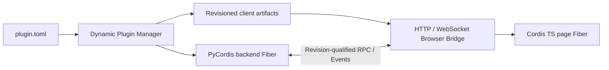

# DeepSeek Harness Python

[English](README.md) | 中文

DeepSeek Harness Python 是一套插件优先的 Agent Harness，由两个协作的 Cordis Runtime 组成。PyCordis 管理 Backend Plugin 和 Python Agent Spine；原有 TypeScript Cordis 保留在浏览器中，管理页面插件。两端通过版本化 Browser Bridge，以显式 JSON RPC 和 Event 通信。

目标是提供稳定的 Harness，使后续产品能力通常只需开发插件，而不用修改 Agent Loop 或任一生命周期内核。

## 架构

一个逻辑插件只有一个根身份，可以包含 Backend Contribution、Client Contribution，或同时包含两者：

```text
plugin.toml
backend.py
frontend/
  package.json
  src/
  dist/client.js
protocol/api.schema.json
```

`plugin.toml` 是权威来源。内部 Python 或 Frontend Package File 只是构建输入，不能重新定义 Plugin ID 或 Version。

| 插件形态 | Runtime | 常见用途 |
|---|---|---|
| 仅 Backend | PyCordis | Tool、LLM Provider、Storage、Workflow、Policy |
| 仅 Client | Cordis TS | Panel、Command、页面状态、浏览器集成 |
| Full Stack | 两端 | 通过 RPC 和 Event 使用 Python Service 的 UI |

两个 Runtime 不共享对象或生命周期状态。Dynamic Plugin Manager 根据 Manifest 和已声明 Artifact 计算一个内容 Revision，启动 Backend Fiber，发布精确 Client Bundle，并将 Desired Graph 投影给已连接页面。每个页面随后为同一 Plugin ID 和 Revision 挂载一个 Cordis TS Child Fiber。



Enable、Update、Rollback 和 Disable 都是运行时操作。Update 会释放旧 Backend Registration，并要求页面先卸载旧 Client Fiber，再激活替代版本。过期 Revision 的 Call 会失去权限。Disable 会移除 Publication、Backend Effect、Page Fiber Contribution 和页面拥有的未完成 Call。

Backend Plugin 通过隔离的 `PLUGIN_RUNTIME_IDENTITY` Service 获得由 Manager 管理的精确身份。导出 `createPlugin(api)` 的 Browser Module 通过 Reconciliation 获得带 Revision 的 `PluginChannel`。Plugin 不自行计算 Runtime Revision，也不把它作为用户配置接收。

## 仓库布局

```text
harness/
frontend/
docs/specs/
docs/source-notes/
tests/
```

Distribution Name 是 `deepseek-harness-python`，唯一支持的 Import Root 是 `harness`。仓库不包含 `src/` 目录或 `deepseek_harness` 兼容包。

## 已实现基础

- PyCordis Service、隔离 Realm、依赖驱动 Fiber、可逆 Effect 和 Event Mode。
- 只追加 Session Event、带 Scope 的 Prompt/Tool/LLM Registry，以及多 Step Agent Loop。
- Backend-Only、Client-Only 和 Full-Stack Plugin 的动态 Install、Enable、Update、Rollback、Disable 和 Uninstall。
- Content-Addressed Client Publication、规范 Browser Bridge Schema、RPC、Event Forwarding、Cancellation 和过期消息拒绝。
- aiohttp HTTP/WebSocket Transport，以及支持 SHA-256 校验和 Fiber Cleanup 的真实 Cordis TS Browser Adapter。

验收证据和明确排除项见[实现进度](docs/progress.md)和[基础完成规范](docs/specs/foundation-completion.md)。

## 开发

```sh
uv sync
uv run python -m unittest discover -s tests -v
uv run ruff check harness tests
uv run pyright

pnpm --dir frontend install
pnpm --dir frontend run typecheck
pnpm --dir frontend run test
pnpm --dir frontend run build
```

当前进程内 Python Backend Host 只适用于可信本地 Plugin。Authentication、Package Distribution、持久化 Inventory 和 Session、Dependency Installation、Signature，以及不受信任 Plugin 的 Process Isolation 仍属于产品或部署工作。
