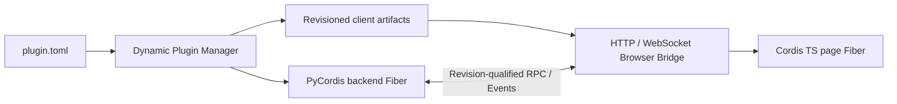

# DeepSeek Harness Python

[English](README.md) | 中文

DeepSeek Harness Python 是一套插件优先的 Agent Harness，由两个协作的 Cordis Runtime 组成。PyCordis 管理 Backend Plugin 和 Python Agent Spine；原有 TypeScript Cordis 保留在浏览器中，管理页面插件。两端通过版本化 Browser Bridge，以显式 JSON RPC 和 Event 通信。

目标是提供稳定的 Harness，使后续产品能力通常只需开发插件，而不用修改 Agent Loop 或任一生命周期内核。

## 架构

一个逻辑插件只有一个根身份，可以包含 Backend Contribution、Client Contribution，或同时包含两者：

```text
plugin.toml
backend.py
frontend/
  package.json
  src/
  dist/client.js
protocol/api.schema.json
```

`plugin.toml` 是权威来源。内部 Python 或 Frontend Package File 只是构建输入，不能重新定义 Plugin ID 或 Version。

| 插件形态 | Runtime | 常见用途 |
|---|---|---|
| 仅 Backend | PyCordis | Tool、LLM Provider、Storage、Workflow、Policy |
| 仅 Client | Cordis TS | Panel、Command、页面状态、浏览器集成 |
| Full Stack | 两端 | 通过 RPC 和 Event 使用 Python Service 的 UI |

两个 Runtime 不共享对象或生命周期状态。Dynamic Plugin Manager 根据 Manifest 和已声明 Artifact 计算一个内容 Revision，启动 Backend Fiber，发布精确 Client Bundle，并将 Desired Graph 投影给已连接页面。每个页面随后为同一 Plugin ID 和 Revision 挂载一个 Cordis TS Child Fiber。



Enable、Update、Rollback 和 Disable 都是运行时操作。Update 会释放旧 Backend Registration，并要求页面先卸载旧 Client Fiber，再激活替代版本。过期 Revision 的 Call 会失去权限。Disable 会移除 Publication、Backend Effect、Page Fiber Contribution 和页面拥有的未完成 Call。

Backend Plugin 通过隔离的 `PLUGIN_RUNTIME_IDENTITY` Service 获得由 Manager 管理的精确身份。导出 `createPlugin(api)` 的 Browser Module 通过 Reconciliation 获得带 Revision 的 `PluginChannel`。Plugin 不自行计算 Runtime Revision，也不把它作为用户配置接收。

Browser Readiness 与 Publication 分开推导。Host 默认要求每个已连接页面都激活 Required Client Contribution；部署可以全局或按 Plugin ID 选择 `any_connected`。Required Client Plugin 在页面连接前保持 `WAITING`，进入 `FAILED` 后可以在不重新发布的情况下恢复，并通过 Manager Snapshot 提供带 Page 信息的诊断。

## 开发插件

受支持的 Python 开发 API 是 `harness.sdk`。Backend-Only Plugin 使用 `define_backend_plugin`；需要 Browser Bridge 的 Plugin 使用 `define_bridge_backend_plugin` 和不包含身份的 RPC/Event Descriptor：

```python
from harness.sdk import define_bridge_backend_plugin, rpc_method

DESCRIBE = rpc_method("describe")

async def setup(ctx):
    await ctx.channel.register_rpc(DESCRIBE, lambda arguments: arguments)

plugin = define_bridge_backend_plugin(setup)
```

Client Plugin 使用对应的 TypeScript SDK。`defineClientPlugin` 将每个 Call、Event、Listener 和自定义 Effect 绑定到 Reconciliation 注入的 Plugin ID、Revision 和 Cordis TS Fiber：

```ts
import { defineClientPlugin, rpcMethod } from '@deepseek-harness/browser-bridge-client'

const describe = rpcMethod<{ value: string }, { value: string }>('describe')

export const createPlugin = defineClientPlugin(async (ctx) => {
  const result = await ctx.call(describe, { value: 'ready' })
  document.body.dataset.plugin = result.value
  return () => { delete document.body.dataset.plugin }
})
```

Production Factory 从不接受 Plugin ID 或 Revision。`harness.sdk.testing` 和 `@deepseek-harness/browser-bridge-client/testing` 下的 Test-Only Harness 会注入 Fixture Identity，但仍执行相同的 Public Lifecycle Path。

使用 Scaffolder 创建完整的 Backend-Only、Client-Only 或 Full-Stack Project：

```sh
uv --directory python run deepseek-harness-plugin create \
  --kind full-stack \
  --plugin-id com.example.echo \
  --destination plugins/echo

uv --directory python run deepseek-harness-plugin validate plugins/echo
```

`python -m harness.scaffold` 与该命令等价。生成过程确定、拒绝任何已存在的目标，并且不会安装依赖。Client Template 会固定 TypeScript SDK Package；该 Package 发布前，仓库开发通过 Template Acceptance Test 所示方式链接 Workspace Package。

## 仓库布局

```text
frontend/
python/
  harness/
  tests/
  pyproject.toml
  uv.lock
docs/specs/
docs/source-notes/
```

Distribution Name 是 `deepseek-harness-python`，唯一支持的 Import Root 是 `python/` Workspace 内的 `harness`。仓库不包含 `src/` 目录或 `deepseek_harness` 兼容包。

## 已实现基础

- PyCordis Service、隔离 Realm、依赖驱动 Fiber、可逆 Effect 和 Event Mode。
- 只追加 Session Event、带 Scope 的 Prompt/Tool/LLM Registry，以及多 Step Agent Loop。
- Backend-Only、Client-Only 和 Full-Stack Plugin 的动态 Install、Enable、Update、Rollback、Disable 和 Uninstall。
- Content-Addressed Client Publication、规范 Browser Bridge Schema、RPC、Event Forwarding、Cancellation 和过期消息拒绝。
- aiohttp HTTP/WebSocket Transport，以及支持 SHA-256 校验和 Fiber Cleanup 的真实 Cordis TS Browser Adapter。
- 支持 Catalog Activation、Browser Bootstrap Delivery、Startup Rollback 和确定性 Shutdown 的可运行 Host Assembly。
- 使用真实 Chromium 覆盖 Full-Stack Activation、RPC、双向 Event、Update、过期 Call 拒绝、Disable 和 Teardown。
- 提供 Python 和 TypeScript 开发 SDK，包括不可变且方向安全的 Descriptor、注入身份、生命周期拥有的 Registration 和内存 Test Harness。
- 提供确定性的 Backend-Only、Client-Only 和 Full-Stack Scaffolding，包括原子且禁止覆盖的生成和 Runtime Validation。
- 提供 Multi-Page Readiness Aggregation，包括 `all_connected` 和 `any_connected` Quorum、Connection Generation 隔离、结构化诊断、恢复和 Disable Drainage。
- 提供 DeepSeek-Compatible Streaming Provider Adapter、FIFO Session Invocation Service、可取消的 Host API 和 HTTP Invocation CLI。

验收证据和明确排除项见[实现进度](docs/progress.md)和[基础完成规范](docs/specs/foundation-completion.md)。

## 运行 Host

先构建 Browser Runtime，再让 Host 读取一个或多个 Catalog Directory；每个目录的直接子目录包含 `plugin.toml`：

```sh
pnpm --dir frontend install
pnpm --dir frontend run build:browser
uv --directory python run deepseek-harness-python \
  --port 0 \
  --plugins ./plugins \
  --client-quorum all_connected \
  --client-quorum-override com.example.preview=any_connected \
  --browser-runtime frontend/dist/browser.js
```

命令会输出实际 URL。`--plugins` 可以重复传入，`uv --directory python run python -m harness` 接受相同参数。Backend-Only Host 可以省略 `--browser-runtime`，此时不会提供 Bootstrap Route。

要启用内置 DeepSeek-Compatible Route，通过环境变量提供凭据，并配置精确的 Provider/Model Pair：

```sh
export DEEPSEEK_API_KEY='...'
uv --directory python run deepseek-harness-python \
  --llm-provider deepseek \
  --llm-model deepseek-chat \
  --port 8765

uv --directory python run deepseek-harness-python invoke \
  --url http://127.0.0.1:8765 \
  'Reply with one short sentence.'
```

Provider 在内部消费 SSE，因此 Raw Chunk 会保留在 Session Log 中，而 Invocation API 只返回终止 Assistant Message。Process-Lifetime Session 的 Turn 按 FIFO 顺序执行。只有请求启用 Provider 时才会读取 API Key；Invoke Command 不会自行读取或直接发送凭据。

需要在线执行生命周期操作时，启用 loopback Plugin Control API。该 API 默认关闭，并且拒绝非 loopback Listener：

```sh
uv --directory python run deepseek-harness-python --control --plugins ./plugins --port 8765
uv --directory python run deepseek-harness-python plugin --url http://127.0.0.1:8765 list
uv --directory python run deepseek-harness-python plugin --url http://127.0.0.1:8765 enable com.example.echo
uv --directory python run deepseek-harness-python plugin --url http://127.0.0.1:8765 update com.example.echo
```

Catalog Watching 是可选的，并且与 HTTP Operation 共用同一个串行 Lifecycle Coordinator。Watcher 可以安装新 Root、热更新有效 Revision，并使用明确的 Create/Delete Policy：

```sh
uv --directory python run deepseek-harness-python \
  --control \
  --plugins ./plugins \
  --watch-plugins ./plugins \
  --watch-debounce 0.5 \
  --watch-create install_disabled \
  --watch-delete disable
```

Control API 面向可信本地开发，不提供 Authentication、Package Download、Dependency Installation、Signature 或不受信任代码隔离。使用 `uv --directory python run deepseek-harness-plugin sdk export PATH` 可以导出内置 Browser SDK Tarball；Client Scaffolding 会以相对 `file:` Dependency 和 Frozen Lockfile 固定使用该 Digest。

## 开发

```sh
uv --directory python sync
uv --directory python run playwright install chromium
uv --directory python run python -m unittest discover -s tests -v
uv --directory python run ruff check harness tests
uv --directory python run pyright

pnpm --dir frontend install
pnpm --dir frontend run typecheck
pnpm --dir frontend run test
pnpm --dir frontend run build
```

当前进程内 Python Backend Host 只适用于可信本地 Plugin。Authentication、Package Distribution、持久化 Inventory 和 Session、Dependency Installation、Signature，以及不受信任 Plugin 的 Process Isolation 仍属于产品或部署工作。当前 Agent Session 只存在于内存，不承诺 Restart Recovery。新的产品 Phase 必须先在 `docs/specs/` 下编写 Normative Specification，并在[实现进度](docs/progress.md)中记录可执行证据。
